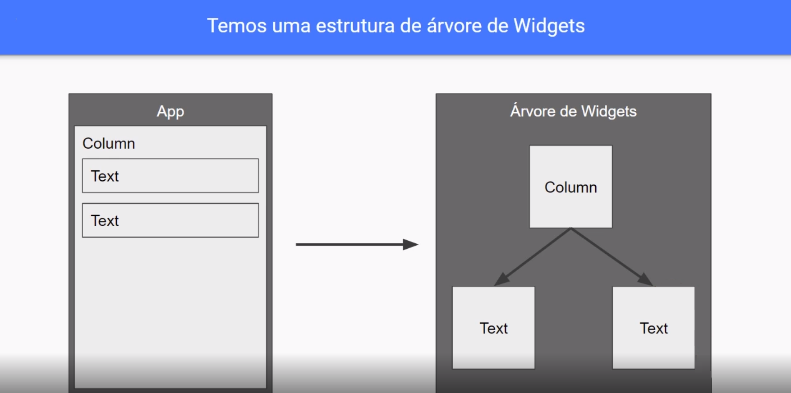

# Flutter Bytebank

Um projeto de estudo criado em acompanhamento aos cursos da formação Flutter da plataforma Alura.

## Getting Started

This project is a starting point for a Flutter application.

A few resources to get you started if this is your first Flutter project:

- [Lab: Write your first Flutter app](https://docs.flutter.dev/get-started/codelab)
- [Cookbook: Useful Flutter samples](https://docs.flutter.dev/cookbook)

For help getting started with Flutter development, view the
[online documentation](https://docs.flutter.dev/), which offers tutorials,
samples, guidance on mobile development, and a full API reference.

## Curso 1
### Emulador

Projeto criado através do comando `flutter create flutter_bytebank`.
Para iniciar o emulador execute `flutter emulators --launch id-do-emulador`. 
O id do emulador pode ser encontrado a partir do comando `flutter emulators`.

No <b>Visual Studio Code</b> selecione o emulador no canto inferior direito, por exemplo: Iphone, Chrome, Nexus. Na barra superior clique em `Run`, Start Debugging ou Run Without Debugging, provavél atalho `Ctrl + F5`, então a aplicação será inicializada no emulador.

### Rect-style
Diferente de outras plataformas, o Flutter cria o layout via código fonte, ou seja, sem a necessidade de um arquivo separado para o layout, como por exemplo, HTML ou XML também conhecido como modo imperativo.

Esse tipo de abordagem é conhecida como estilo de reação (react-style) ou declarativa (declarative). 

Artigos:
 - [Introduction to declarative UI](https://docs.flutter.dev/get-started/flutter-for/declarative)
 - [A era das Interfaces Declarativas no desenvolvimento para dispositivos móveis](https://medium.com/kobe-tech/a-era-das-uis-declarativas-uma-vis%C3%A3o-geral-e-comparativo-de-cada-uma-das-novas-ferramentas-de-d3b4275fb11e)

### Widgets
Cada widget representa um elemento visual na tela.
A documentação com lista de Widgets pode ser encontrada em https://docs.flutter.dev/development/ui/widgets.

